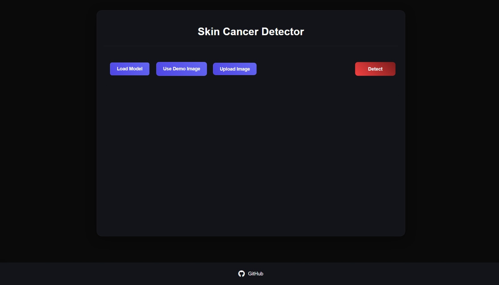
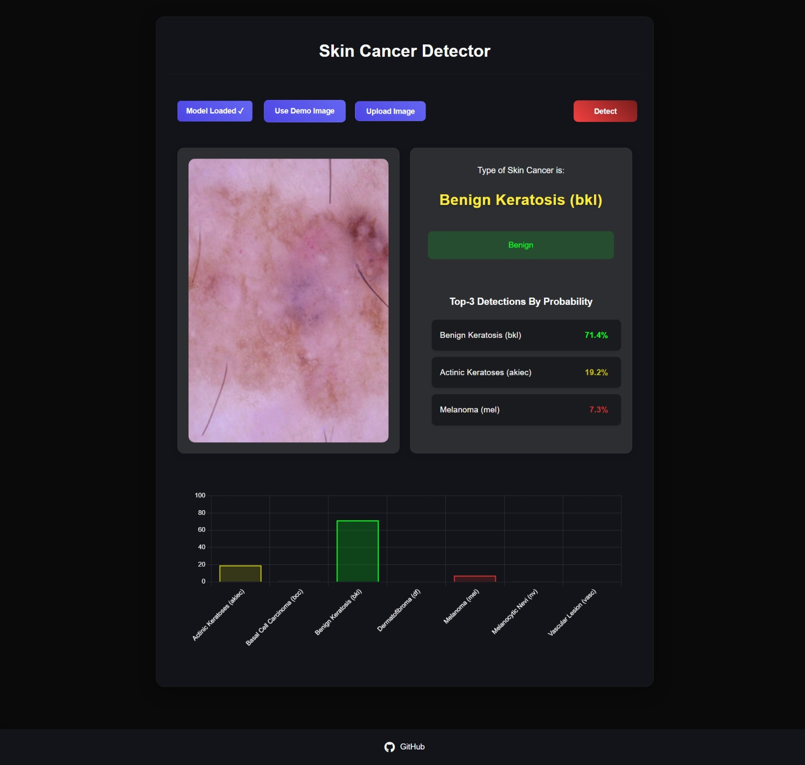
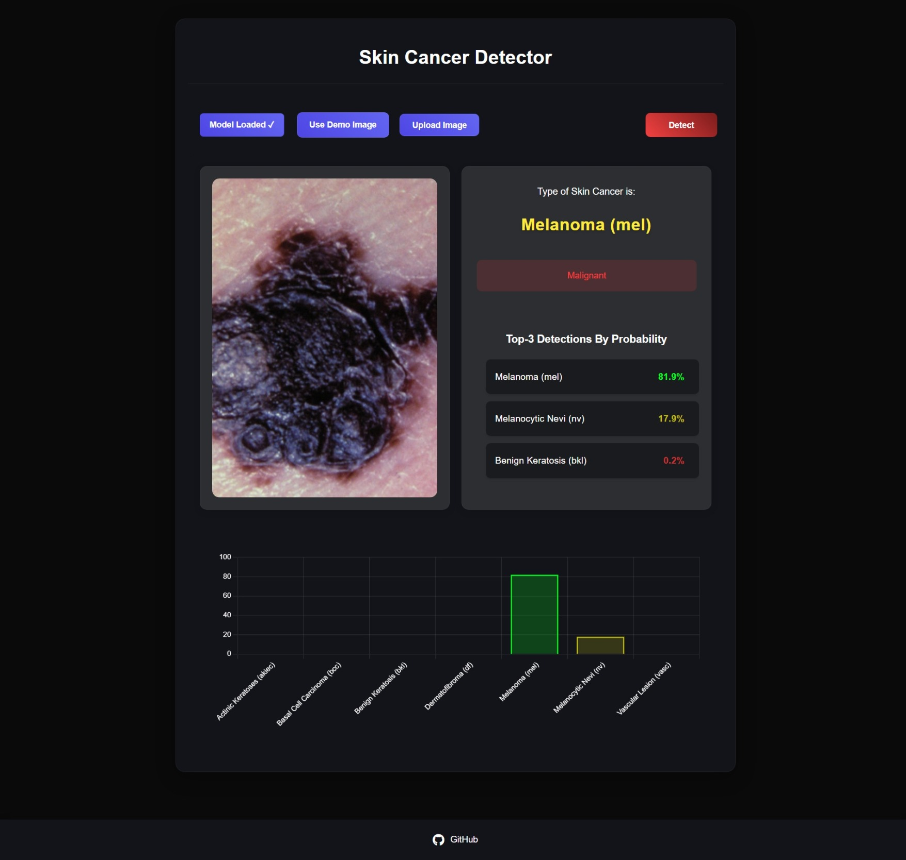

Here is the Markdown version of your refined text:

```markdown
# Skin Cancer Detector Web Application

This application presents an advanced, web-based framework for the classification of various skin cancer types through the implementation of deep learning methodologies and TensorFlow.js. By leveraging the capabilities of pre-trained models, users can upload dermoscopic images of skin lesions and obtain predictive insights into potential skin cancer diagnoses.

---

## Purpose

This application harnesses state-of-the-art computer vision techniques to deliver the three most probable diagnoses for a given skin lesion. Developed exclusively for **educational purposes**, it demonstrates the practical application of deep learning in dermatological imaging. Importantly, the model functions as a classifier for skin cancer types based on the uploaded images and is not intended to serve as a substitute for professional medical consultation or diagnosis.

---

## Features

- 🕒 **Real-Time Detection**: Facilitates instantaneous detection of skin cancer using TensorFlow.js.
- 📋 **Multi-Type Classification**: Supports the identification of multiple skin cancer types.
- 🖱️ **User-Friendly Interface**: Incorporates an intuitive drag-and-drop functionality for image uploads.
- 🖼️ **Demo Images**: Provides sample images to evaluate the model's capabilities.
- 📊 **Detailed Predictions**: Outputs the top three classification results alongside their respective probability scores.
- 📱 **Responsive Design**: Optimized for seamless functionality across mobile and desktop platforms.
- 📈 **Interactive Visualization**: Enhances user experience with graphical representations of prediction outcomes.

---

## Technologies Used

- 🧠 **TensorFlow.js**: Enables real-time inference using deep learning models.
- 🌐 **HTML5/CSS3**: Structures and styles the frontend design.
- 📜 **JavaScript**: Implements client-side logic and interaction.
- 📉 **Chart.js**: Generates dynamic visualizations of prediction probabilities.
- 🏗️ **MobileNet Architecture**: Employs an efficient, pre-trained image classification model.

---

## Lesion Types

The model identifies the following lesion categories:

- **nv**: Melanocytic nevi, benign neoplasms of melanocytes, exhibiting diverse morphological variations.
- **mel**: Melanoma, a malignant neoplasm originating from melanocytes, treatable with early excision.
- **bkl**: Benign keratosis lesions, encompassing seborrheic keratoses, solar lentigines, and lichen-planus-like keratoses.
- **bcc**: Basal cell carcinoma, a prevalent epithelial skin cancer with low metastatic potential.
- **akiec**: Actinic keratoses and intraepithelial carcinoma (Bowen’s disease), UV-induced conditions potentially progressing to invasive squamous cell carcinoma.
- **vasc**: Vascular lesions, including cherry angiomas and pyogenic granulomas.
- **df**: Dermatofibroma, a benign cutaneous lesion.

Descriptions are derived from authoritative dermatological research and literature.

---

## Disclaimer

This tool is explicitly designed for **educational purposes** and should not be utilized as a diagnostic resource. While the model provides classifications of skin cancer types based on input images, it is neither certified nor intended to replace expert medical evaluation. Users must consult qualified healthcare professionals for any medical concerns.

---

## Getting Started

### Prerequisites

- 🌐 A modern web browser (e.g., Chrome, Firefox, Safari, Edge).
- 📶 An active internet connection (necessary for loading the TensorFlow.js model).

### Running Locally

1. 📥 Clone the repository:
   ```bash
   git clone https://github.com/Arianrezaz/SkinCancerTypeDetection.git
   cd SkinCancerTypeDetection
   ```

2. 🚀 Launch a local server:

   **Using Python:**
   ```bash
   python -m http.server 8000
   ```

   **Using Node.js:**
   ```bash
   npx http-server
   ```

3. 🌐 Access the application via your browser:
   - **Python**: [http://localhost:8000](http://localhost:8000)
   - **Node.js**: [http://localhost:8080](http://localhost:8080)

---

## Usage

1. 🖼️ **Demo Testing**:
   - Select "Use Demo Image" to test pre-loaded images.

2. 📂 **Image Upload**:
   - Upload an image of a skin lesion by clicking "Upload Image."

3. 🔍 **Prediction**:
   - Click "Detect" to generate predictions.
   - Review the top three predictions, complete with confidence scores.

4. 📈 **Visualization**:
   - Examine the interactive probability distribution chart for a detailed breakdown of the predictions.

---

## Model Information

The application employs a fine-tuned MobileNet model trained on high-quality dermatological datasets. It demonstrates robust performance in distinguishing among various skin conditions, including:

- **Melanoma**
- **Basal Cell Carcinoma**
- **Squamous Cell Carcinoma**
- Additional dermatological conditions

### Datasets Used

The training process leveraged public datasets, notably the **ISIC (International Skin Imaging Collaboration)** dataset and the **HAM10000 dataset**, encompassing a comprehensive array of labeled dermoscopic images. These datasets are governed by a **CC BY-NC-SA 4.0 license**, prohibiting commercial use.

### Image Format

The system supports image uploads in **JPG** and **PNG** formats. However, as the model was not specifically trained on mobile-captured images, prediction accuracy may vary.

### Published Design

The complete design methodology and associated training processes are accessible via Kaggle. Explore the open-source notebooks and empirical results [here](https://www.kaggle.com/).

---

## Screenshots

### Home Page


### Benign Results


### Malignant Results


---

## Contributing

Contributions to this project are encouraged. Submit pull requests to propose enhancements or address issues.

---

## Acknowledgments

- 💡 Gratitude to the TensorFlow.js team for their groundbreaking framework.
- 🏗️ Appreciation for the developers of the MobileNet architecture.
- 📊 Recognition of contributors to the ISIC and HAM10000 datasets.

---

## Contact

**Arian Rezazadeh**  
Email: [arian.rmn5281@gmail.com](mailto:arian.rmn5281@gmail.com)
```

Let me know if you need further modifications!